# KIA CANBUS

Подключаем Android-магнитолу TEYES/CC4 к штатной панели Kia через переделанный USB CAN-адаптер: TPMS, медиа, звонки, навигация, RCTA, CANBUS и обновления APK без отдельного закрытого сервера.

[](https://github.com/mrglonin/kia/raw/main/updates/kia_351.apk)

- APK KIA: [updates/kia_351.apk](https://github.com/mrglonin/kia/raw/main/updates/kia_351.apk)
- APK Yandex Navigator mod: [updates/yandex/yandex_navi-7_10-arm7-kia-mod.apk](https://github.com/mrglonin/kia/raw/main/updates/yandex/yandex_navi-7_10-arm7-kia-mod.apk)
- Манифест обновлений: [updates/latest.json](updates/latest.json)
- Текущий публичный релиз: `22.41` / `351`

## Релиз

| Компонент | Версия | Файл | SHA-256 |
| --- | --- | --- | --- |
| KIA app | `22.41` / `351` | `updates/kia_351.apk`, 5.6 MB | `caacec68ed27a9ace02c16c6e846eca2a7b3ad27d5d3ba363fab2cbb5d4d7a6d` |
| Yandex Navigator Kia mod | `7.10-kia.20260608` / `71011061` | `updates/yandex/yandex_navi-7_10-arm7-kia-mod.apk`, 76 MB | `eeddc935570e1dafb76e3aef89ed9515e6d8e9065089726bcef83efd3b5cfd46` |

## Что работает

- Поддерживается только адаптер после переделки и прошивки от автора Drive2: [профиль автора](https://www.drive2.ru/users/76508/), [информация о переделке адаптера](https://www.drive2.ru/l/717368666034802531/).
- TPMS-экран под Kia: давление, температура, предупреждения, ускоренный опрос при аварийных значениях.
- Медиа и звонки: TEYES/CC4, Android-плееры, BT/USB/FM/AM, подписи источника и текста на приборку.
- Навигация: Yandex Core Bridge, 2GIS fallback, режимы `обычный`, `TBT`, `стрелка к финишу`, lane/gray-road/micro-maneuver логика.
- RCTA: предупреждение слева/справа/с двух сторон, overlay поверх камеры, звук, настройка стиля.
- CAN/USB: обмен с переделанным адаптером, TPMS poll, температура панели и health-статус адаптера.
- Обновления: KIA APK и Yandex mod APK через `updates/latest.json`.

## Скриншоты

| TPMS | TPMS warning |
| --- | --- |
| 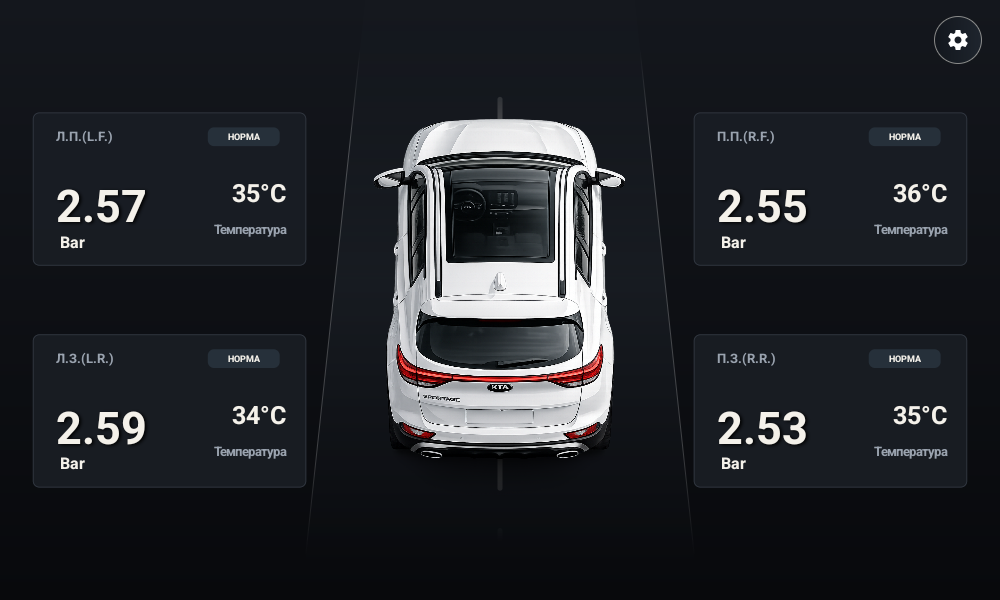 | 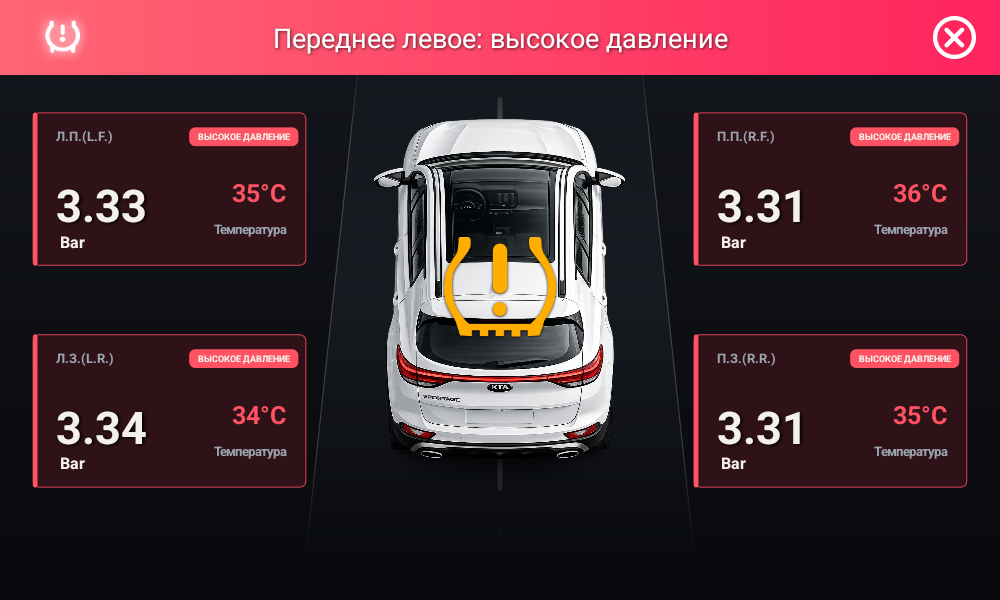 |

| Widget mode | Sunroof |
| --- | --- |
| 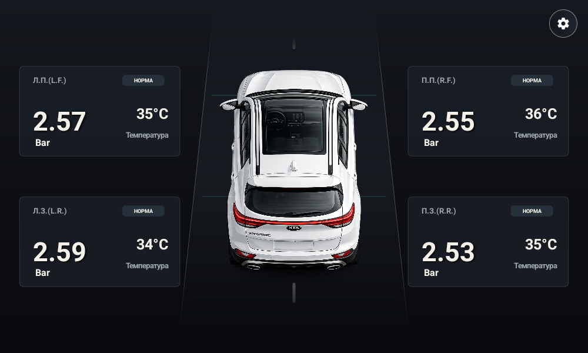 | 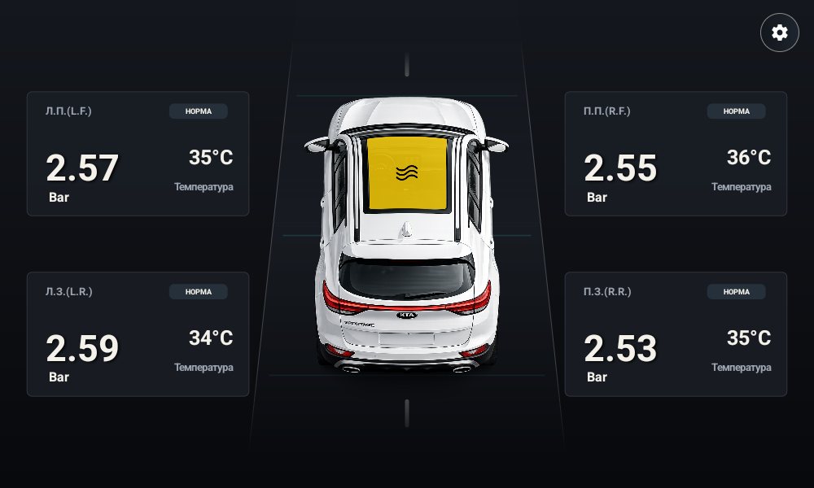 |

| RCTA overlay | RCTA settings |
| --- | --- |
| 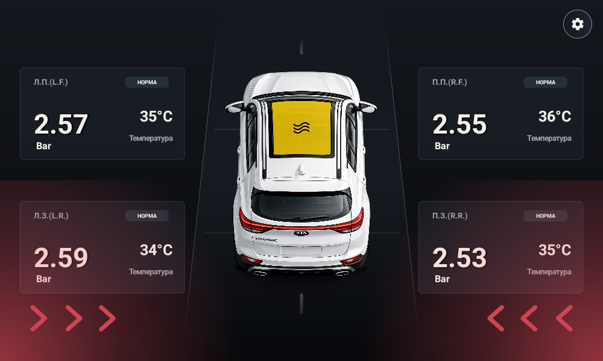 | 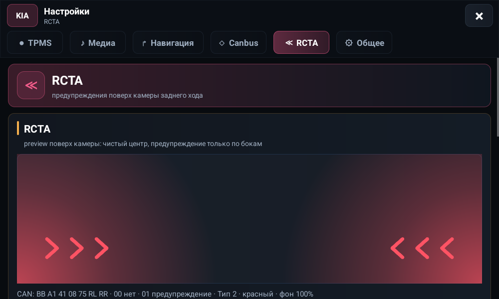 |

| Navigation | Media |
| --- | --- |
| 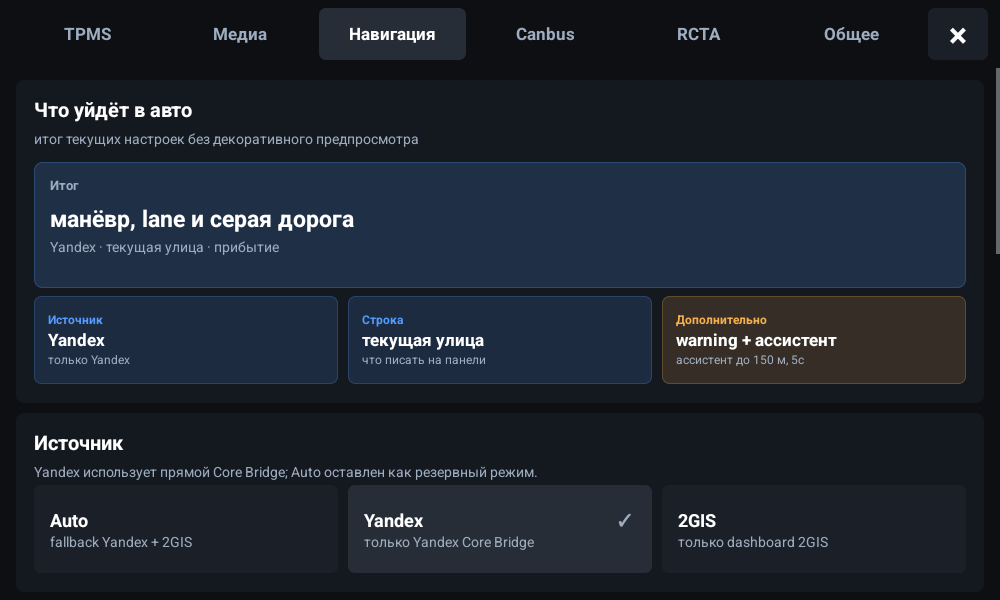 | 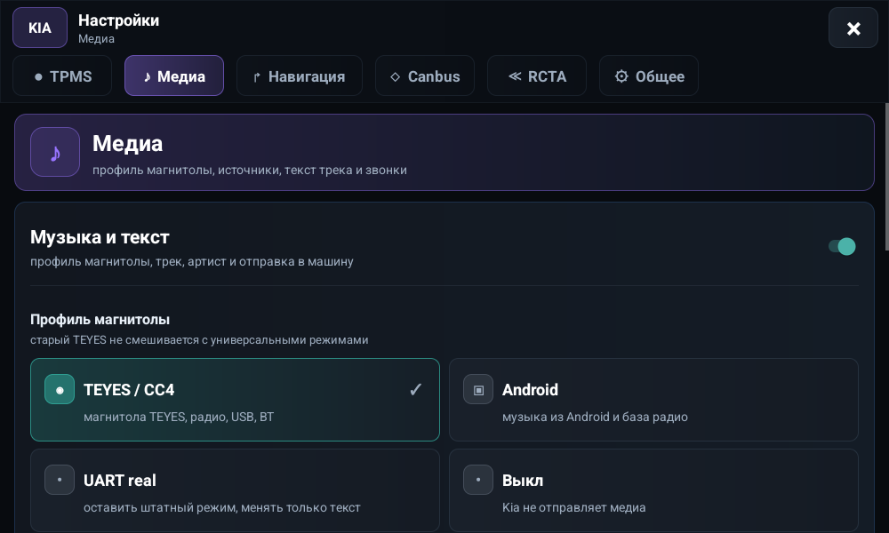 |

| TPMS settings | CANBUS |
| --- | --- |
| 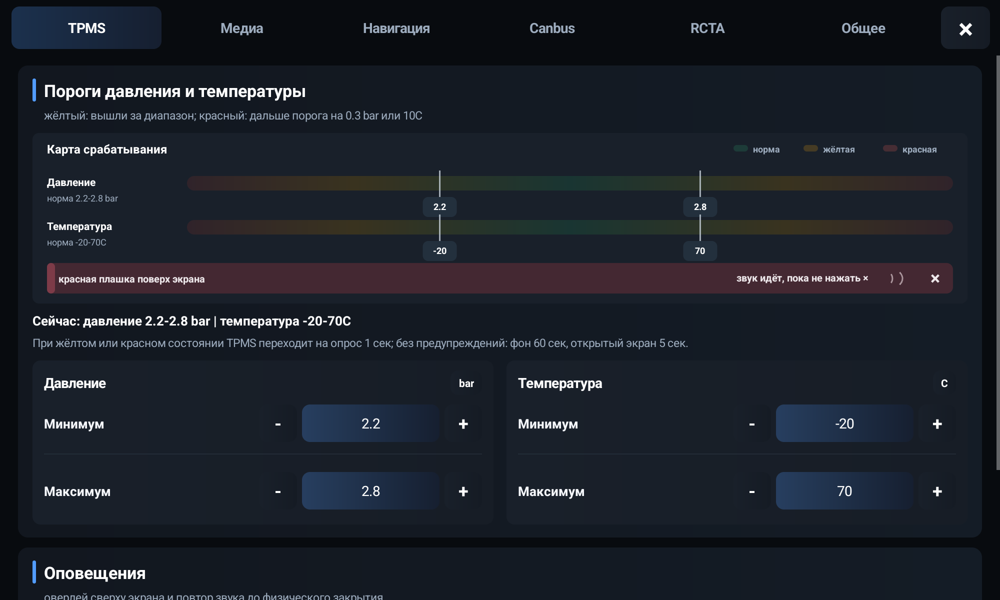 | 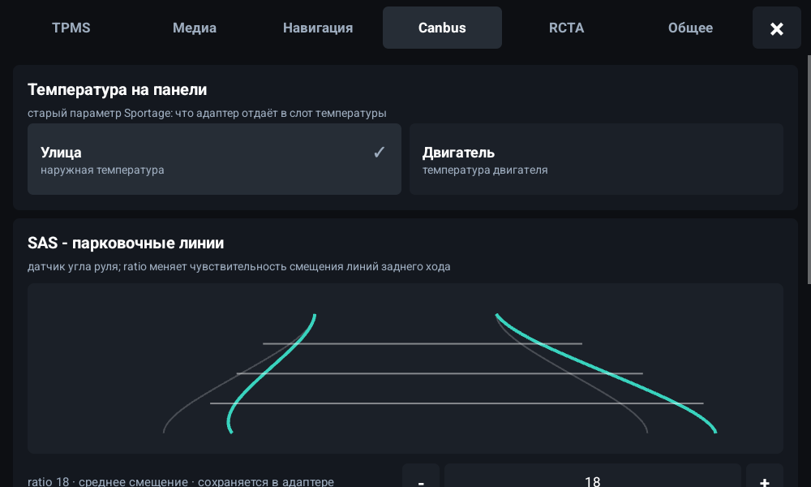 |

| General |
| --- |
| 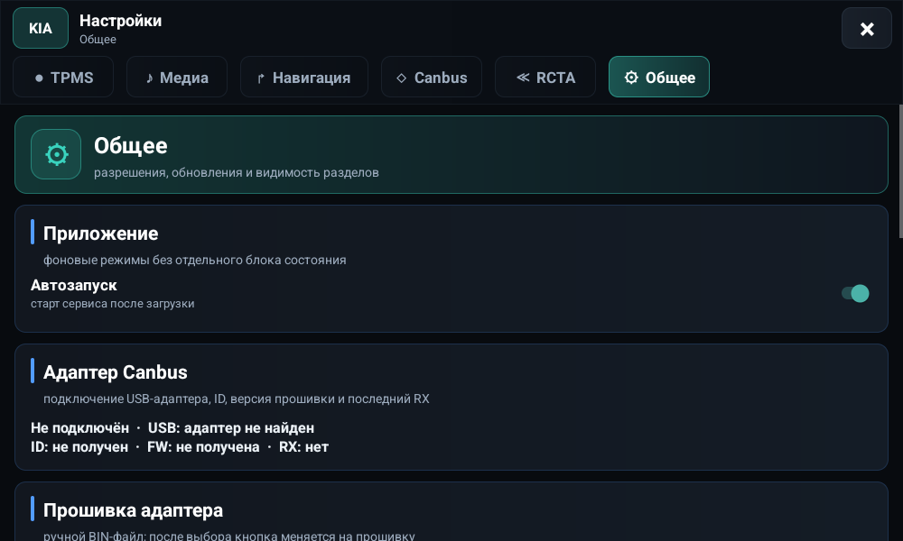 |

## Установка

ADB:

```bash
adb install -r updates/kia_351.apk
adb install -r updates/yandex/yandex_navi-7_10-arm7-kia-mod.apk
```

На магнитоле:

1. Установить `kia_351.apk`.
2. Выдать runtime permissions: уведомления, геолокация, Bluetooth, audio/media.
3. Включить специальные права: поверх окон, изменение системных настроек, доступ к уведомлениям, игнор оптимизации батареи.
4. Подключить USB CAN-адаптер, переделанный и прошитый по инструкции автора: [Drive2 76508](https://www.drive2.ru/users/76508/), [переделка адаптера](https://www.drive2.ru/l/717368666034802531/).
5. Установить Yandex Navigator mod, если нужна интеграция через Kia bridge.

## Сборка

Требования: Android SDK, JDK 17 из Android Studio, Gradle wrapper из `app/`.

```bash
cd app
JAVA_HOME="/Applications/Android Studio.app/Contents/jbr/Contents/Home" \
ANDROID_HOME="/Users/legion/Library/Android/sdk" \
./gradlew :app:assembleRelease --console=plain
```

Release-сборка подписывается публичным debug-keystore из `signing/kia-debug-release.keystore`, чтобы публичный APK можно было пересобрать с той же подписью. Для своего форка меняйте keystore в `app/app/build.gradle`.

## QA

Быстрые сценарии через встроенный `QaReceiver`:

```bash
ADB=/Users/legion/Library/Android/sdk/platform-tools/adb
$ADB -s emulator-5554 install -r updates/kia_351.apk
$ADB -s emulator-5554 shell am start -n kia.app/.entry.MainActivity
$ADB -s emulator-5554 shell am broadcast -n kia.app/.qa.QaReceiver -a kia.app.QA_SCENARIO --es scenario tpms_sample
$ADB -s emulator-5554 shell am broadcast -n kia.app/.qa.QaReceiver -a kia.app.QA_SCENARIO --es scenario tpms_high_pressure_warning
$ADB -s emulator-5554 shell am broadcast -n kia.app/.qa.QaReceiver -a kia.app.QA_SCENARIO --es scenario nav_stale_lane_conflict_sample
$ADB -s emulator-5554 shell am broadcast -n kia.app/.qa.QaReceiver -a kia.app.QA_SCENARIO --es scenario rcta_both
```

Проверка установленной версии:

```bash
adb shell dumpsys package kia.app | grep -E 'versionCode|versionName|lastUpdateTime'
```

## Структура

- `app/` - Android Gradle project для `kia.app`.
- `updates/` - публичные APK и `latest.json`.
- `updates/yandex/` - installable Yandex Navigator Kia mod APK.
- `signing/` - публичный debug release keystore.
- `tools/` - CAN/UART/navigation/APK utilities.
- `docs/screenshots/` - скриншоты текущего публичного релиза.

## Границы

- APK Yandex Navigator mod лежит как готовый installable artifact; права на Yandex/брендовые компоненты не переоформляются этим репозиторием.
- Рабочий USB CAN-адаптер не является обычным заводским адаптером: нужна переделка и прошивка от [автора Drive2](https://www.drive2.ru/users/76508/), описание здесь: [drive2.ru/l/717368666034802531](https://www.drive2.ru/l/717368666034802531/).
- Публичный debug-keystore нужен для воспроизводимости обновлений, не используйте его как приватный production key.
- `updates/latest.json` и ссылки в этом README указывают на текущий публичный `main`.

## Лицензия

Исходный код KIA-приложения и локальные tools открыты по MIT License. Сторонние APK, фирменные изображения, логотипы и материалы сохраняют права владельцев.
